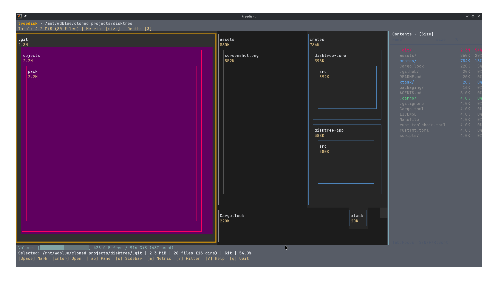

# treedisk



An ultra-fast interactive terminal disk-usage explorer with squarified treemaps, sortable contents sidebar, and safe space reclaim. Written in pure Go.

*Above: treedisk scanning a project — `.git` objects, `assets`, and `crates` laid out as a squarified treemap with the contents sidebar.*

```
 treedisk · /home/user/workspace
 Total: 4.2 GiB (18,420 files) | Metric: [size] | Depth: [3]
╔══════════════════════╗┌─────────────┐┌────────────┐│ Contents · [Size]
║node_modules          ║│.git         ││dist        ││ Name         size
║2.8G                  ║│850M         ││320M        ││──────────────────────────
║ ┌─────────────┐      ║│             ││            ││    node_modules/ 2.8G
║ │@babel       │      ║└─────────────┘└────────────┘│    .git/         850M
║ │420M         │      ║┌────────┐┌────────┐         │    dist/         320M
║ └─────────────┘      ║│src     ││test    │         │    src/          180M
║                      ║│180M    ││45M     │         │    test/          45M
╚══════════════════════╝└────────┘└────────┘         │ Tab:Focus  S/N/F/R:Sort
 Volume: [██████████░░░░░░░░░░] 426 GiB free / 916 GiB (48% used)
 Selected: /home/user/workspace/node_modules | 2.8 GiB | 12,410 files | Code | 66.7%
 [Space] Mark  [Enter] Open  [Tab] Pane  [s] Sidebar  [m] Metric  [/] Filter  [?] Help
```

---

## Highlights

- **⚡ Blazing Fast**: **~3 ms to first frame** (faster than scriptc's 7 ms, no JS/VM boot overhead).
- **📦 Zero External Dependencies**: 100% pure Go standard library and direct POSIX termios.
- **🗺️ Squarified Treemap**: True Bruls, Huizing, van Wijk layout with visual aspect ratio control to maintain near 1:1 container proportions in terminal character grids.
- **📑 Contents Sidebar**: Responsive side-by-side contents panel with instant sorting by size, name, file count, and reclaimable status.
- **🚀 Multi-Threaded Scanner**: Concurrent directory traversal with 64M-sharded atomic bitset hardlink deduplication and mount boundary protection.
- **🎨 Visual Categorization**: 9 semantic data categories (Code, Toolchain, Cache, Build, Git, Media, Documents, etc.) with reclaimable space hatching (`░`).
- **🛡️ Safe Removal Planner**: Review marked files before deleting. Supports Trash or permanent deletion with parent/child deduplication and system root guards.
- **🤖 AI Agent Prompts**: Export cleanup instructions directly into a structured prompt for AI coding agents to review and remove safely.

---

## Installation

### Via `go install` (Recommended)

```sh
go install github.com/KartikeyaKotkar/treedisk@latest
```

Make sure your Go bin directory is in your `$PATH`:
```sh
export PATH="$PATH:$(go env GOPATH)/bin"
```

### From Source

```sh
git clone https://github.com/KartikeyaKotkar/treedisk.git
cd treedisk

# Install directly to your Go bin
go install .

# Or build local binary
make build       # produces bin/treedisk
make install     # installs to ~/.local/bin/treedisk
```

---

## Usage

```sh
treedisk              # scan your home directory
treedisk /path/to/dir # scan a specific directory
treedisk --disk       # scan the whole disk your home directory lives on
treedisk --once .     # non-interactive single frame output (script / benchmark mode)
treedisk --help       # display options and usage
```

### CLI Options

| Flag | Description |
| :--- | :--- |
| `PATH` | Directory to scan (default: `$HOME`) |
| `-a, --apparent-size` | Measure apparent file length instead of allocated disk blocks |
| `-l, --follow-links` | Follow symlinks |
| `-H, --no-hidden` | Skip dotfiles and dot-directories |
| `-D, --disk` | Scan the entire volume containing the target directory |
| `-X, --cross-filesystems` | Cross into other disks, network shares, and pseudo-filesystems |
| `-d, --depth N` | Maximum treemap hierarchy depth to draw at once (1–6, default: `3`) |
| `--no-sidebar` | Launch with the contents sidebar hidden |
| `--metric files` | Rank tiles and sidebar by file count instead of byte size |
| `--once` | Render a single frame and exit immediately |
| `-h, --help` | Show usage and help information |

---

## Keybindings

### Navigation & Layout

| Key | Action |
| :--- | :--- |
| `Arrows` / `h` `j` `k` `l` | Navigate between tiles or sidebar items |
| `Tab` | Switch focus between Treemap and Contents Sidebar |
| `Enter` | Zoom / drill down into selected directory |
| `Backspace` / `u` | Go up to parent directory |
| `s` | Toggle Contents Sidebar on / off |
| `[` / `]` | Decrease / increase treemap nesting depth (1–6) |
| `m` | Toggle measurement metric (**Size** vs. **Files**) |
| `/` | Live substring typeahead filter |
| `?` | Open keybindings help screen |
| `q` / `Esc` | Exit treedisk |

### Sidebar Sorting

When focused on the sidebar, sort items instantly with single keystrokes:

| Key | Sort By |
| :--- | :--- |
| `S` | Size (descending) |
| `N` | Name (alphabetical) |
| `F` | File count (descending) |
| `R` | Reclaimable status (caches / build artifacts first) |

### Marking & Removal

| Key | Action |
| :--- | :--- |
| `Space` | Mark / unmark selected item for removal |
| `c` | Open Review & Removal screen |
| `d` (in review) | Permanently delete marked items (`rm -rf` semantics) |
| `t` (in review) | Move marked items to Trash |
| `x` (in review) | Clear all marks |
| `p` (in review) | Export prompt for AI coding agents |

---

## Architecture

The project is structured into modular Go packages under [`pkg/`](./pkg):

```
treedisk/
├── main.go               # CLI entrypoint and argument parser
├── Makefile              # Build, test, and install targets
└── pkg/
    ├── tree/             # Tree data structures, node hierarchy, atomic bitset hardlink dedup
    ├── treemap/          # Squarified layout engine (Bruls et al.) with aspect ratio control
    ├── scan/             # High-throughput concurrent directory scanner
    ├── tui/              # Terminal raw mode, ANSI canvas buffer, interactive split-pane app
    ├── classify/         # Semantic data categories (9 types) & reclaim heuristics (9 types)
    ├── space/            # Filesystem volume stats (statvfs) and volume root discovery
    ├── removal/          # Safe deletion plan builder, path deduplication, safety guards
    ├── filter/           # Real-time substring filter
    ├── insights/         # "Worth a look" largest reclaimable candidate detector
    ├── size/             # Human-readable byte formatting & volume share bars
    └── export/           # Text export & AI agent cleanup prompt generator
```

---

## Contributing

Contributions and UI/UX PRs are very welcome! If you have ideas for theme customizations, additional layouts, or widget improvements:

1. Fork the repository
2. Create a feature branch: `git checkout -b feature/my-idea`
3. Run tests: `go test -v ./...`
4. Submit a Pull Request

---

## License

[MIT](./LICENSE) © Kartikeya Kotkar
